# HTTP:
## DNS.py
Programul DNS.py foloseşte CloudFlare.com pentru a afla adresa IP a unui site.
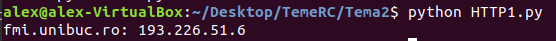

## Cereri de tip **GET**
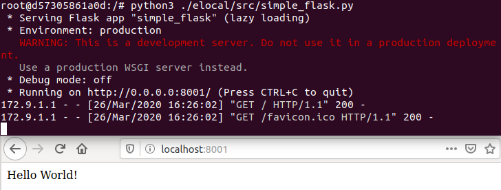

## Cereri de tip **POST**
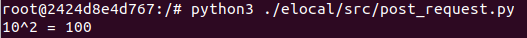
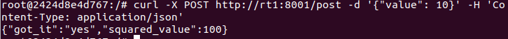

# UDP:
## Comunicare pe acelaşi container
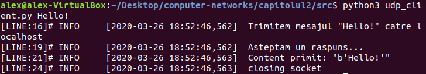
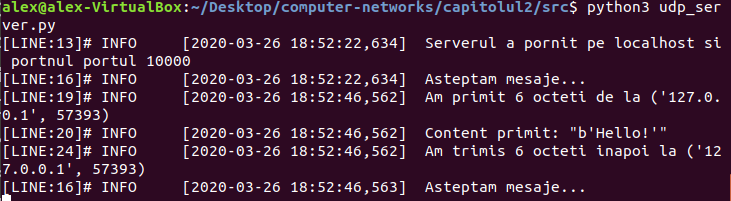

## Comunicare pe containere diferite
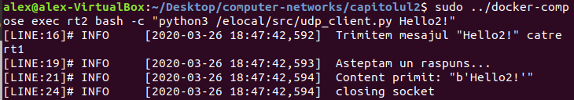
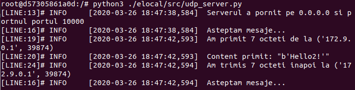

## tcpdump
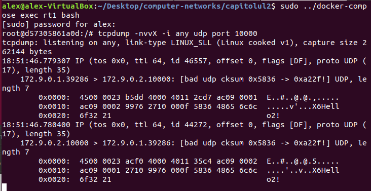

## Comunicare cu serverul de pe rt1 de la host
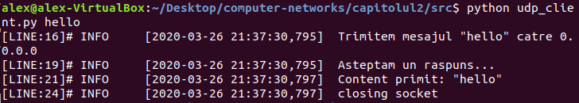
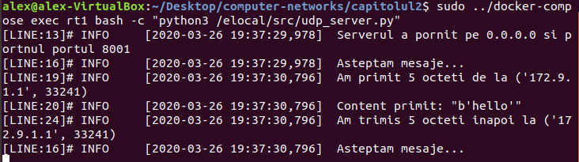
